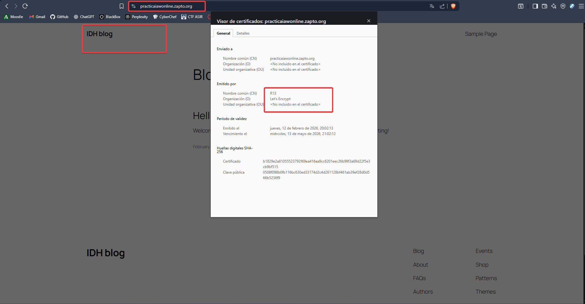
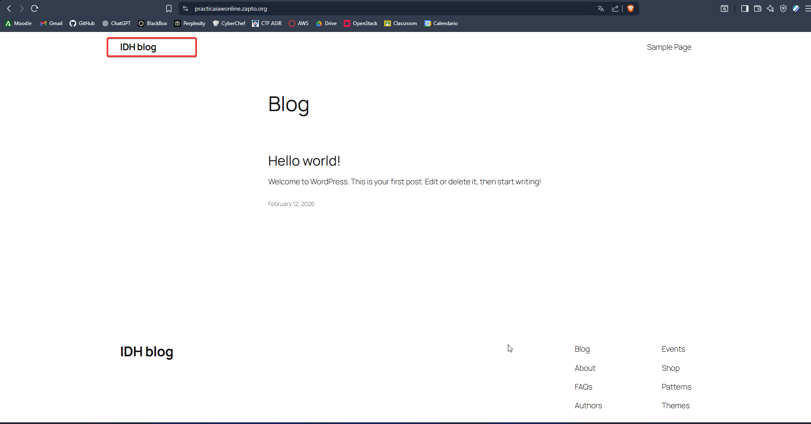
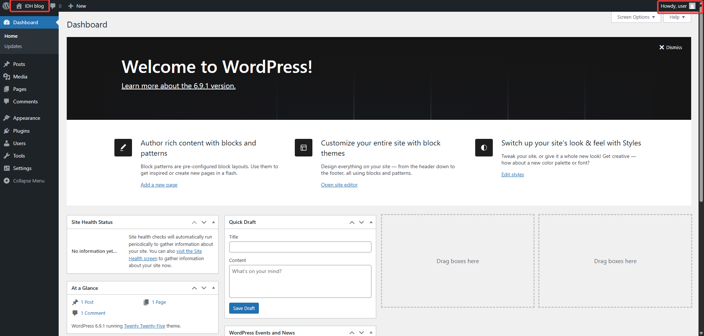
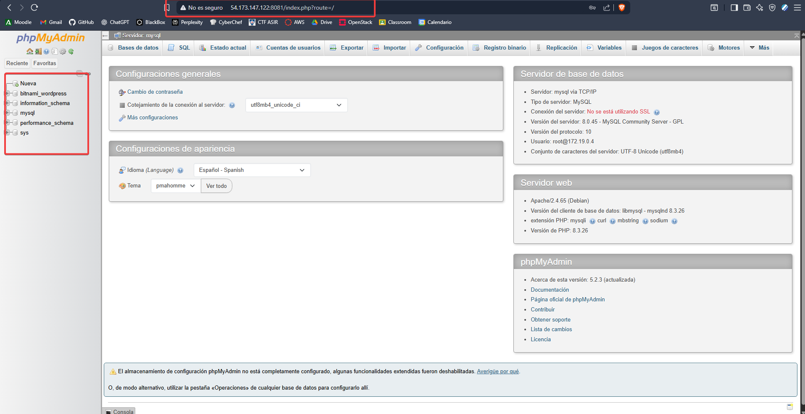

# Practica-5.2 Docker con Wordpress

- Esta practica consiste en levantar varios contenedores con la finalidad de obtner un Wordpress certificado por LetsEncrypt, para esto necesitamos el contendor de Wordpress que usaremos una imagen de bitnami, mysql que sera la base de datos de wordpress, phpmyadmin para poder acceder a la base de datos y por ultimo el https-portal que es el encargado de hablar con los contenedores mediante http y el aplicarle los certificados ssl para asi establecer una conexion segura con ellos mediante https, empezaremos viendo nuestro docker-compose.yml y que hace cada cosa.


## Redes
- Lo primeor vamos a definir dos redes para separar la comunicacion de los contenedores y asi aislar la base de datos para que esta solo se comunique con el contendor de wordpress, esta sera la red **backend** y los demas estaran en la frontend que seran los que salgan a la red por el https-portal.
``` yml
networks:
  frontend-network:
    driver: bridge
  backend-network:
    driver: bridge
```

## Mysql
- Establecemos el contenedor de mysql que vamos a usar donde le damos mediante nuestro archivo .env las variables necesarias para la creacion del contendor, esto es importante ya que sin estas variables no se creara el contenedor de forma correcta, en este caso veremos un ejemplo de las variables que hemos puesto en el contenedor de como deberian de estar en nuestro .env, y es importante como podemos observar la red a la que esta conectado este contenedor la cual es la backend y solo esta.

``` yml
# Configuración Base de Datos
MYSQL_ROOT_PASSWORD=password_maestro
MYSQL_DATABASE=bitnami_wordpress
MYSQL_USER=bn_wordpress
MYSQL_PASSWORD=bitnami_password
```
- Con esto definido ya tendriamos listo nuestro contenedor para que funcione usando la estrucutra siguiente.

``` yml
mysql:
    image: mysql:8.0
    container_name: mysql
    restart: always
    env_file: .env
    environment:
      - MYSQL_ROOT_PASSWORD=${MYSQL_ROOT_PASSWORD}
      - MYSQL_DATABASE=${MYSQL_DATABASE}
      - MYSQL_USER=${MYSQL_USER}
      - MYSQL_PASSWORD=${MYSQL_PASSWORD}
    networks:
      - backend-network
    volumes:
      - ./mysql_data:/var/lib/mysql
```

## Wordpress
- Nuestro Wordprees, el gestor de contenidos que tenemos que desplegar para esta practica, hemos usado la imagen de bitnami para que sea el proceso mas sencillo, le hemos asignado que depedene del contenedor mysql para funcionar, le importaremos las variables de nuestro .env, ademas de que lo conectaremos a las 2 redes ya que este tanto tiene que mandar informacion fuera de la maquina mediante el https-portal y tiene que comunicarse con la base de datos en el backend ademas de que le creamos unos volumenes para que se aloje la pagina web.

``` yml
# Configuración WordPress
WORDPRESS_BLOG_NAME="IDH blog"
WORDPRESS_DATABASE_HOST=mysql
WORDPRESS_DATABASE_PORT_NUMBER=3306
WORDPRESS_DATABASE_USER=bn_wordpress
WORDPRESS_DATABASE_PASSWORD=bitnami_password
WORDPRESS_DATABASE_NAME=bitnami_wordpress
WORDPRESS_EMAIL=user@example.com
```

``` yml
wordpress:
    image: bitnami/wordpress:latest
    container_name: wordpress
    restart: always
    depends_on:
      - mysql
    env_file: .env
    networks:
      - frontend-network
      - backend-network
    volumes:
      - ./wordpress_data:/bitnami/wordpress
```

## PhpmyAdmin

- Con este contenedor podremos monitorizar las bases de datos que tengamos instalado en nuestro mysql, para ello usamos el siguiente fragmento para crearlo, este esta comunicado tanto como el frontend y el bakcend para tener acceso a la base de datos.

``` yml
 phpmyadmin:
    image: phpmyadmin/phpmyadmin
    container_name: phpmyadmin
    restart: always
    depends_on:
      - mysql
    environment:
      - PMA_HOST=mysql
    networks:
      - frontend-network
      - backend-network
    ports:
      - "8081:80"
```

## Https-Portal

- El encargado de aplciar ese candadito verde a nuestro wordpres, este es hace de intermediario hablando con el wordpress en http y sacando la comunicacion al exterior mediante https, a diferencia de otros este solo esta conectado a la red frontend, y desde ahi es de donde realiza su trabajo para eso usamos el siguiente fragmento de codigo, y la unica variable que cargamos desde nuestro .env es nuestro dominio que podemos usarlo como variable como se ve en el ejemplo o podemos cargarlo directamante escribiendolo a mano.

``` yml
DOMAIN=practicaiawonline.zapto.org
```

```yml
  https-portal:
    image: steveltn/https-portal:1
    container_name: https-portal
    restart: always
    depends_on:
      - wordpress
    ports:
      - '80:80'
      - '443:443'
    env_file: .env
    environment:
      DOMAINS: '${DOMAIN} -> http://wordpress:8080'
      STAGE: 'production'
    networks:
      - frontend-network
```
##
- Con todo esto es suficiente para poder levnatar nuestro contenedor usando un **docker compose up -d** y poner a correr todos los servicios, ademas podemos echar un vistazo al archivo completo si fuera necesario.


## Pruebas Visuales

<br>
<br>
<br>
<br>