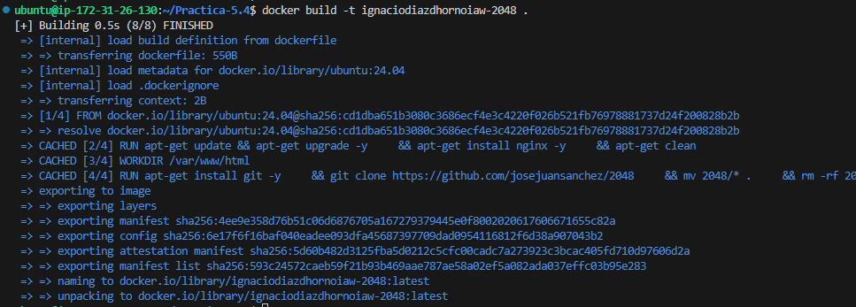
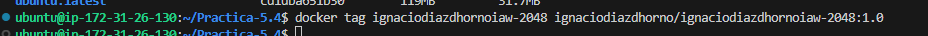
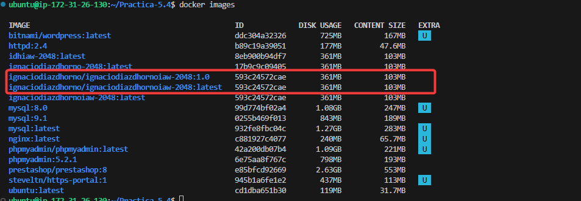
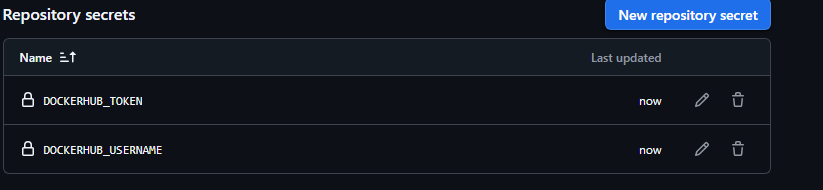
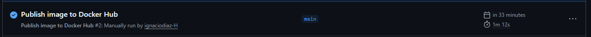
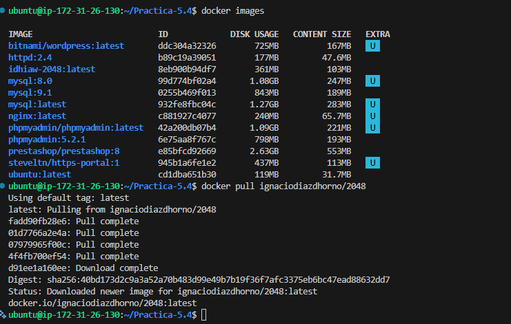
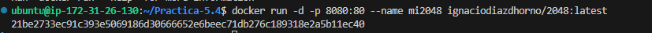
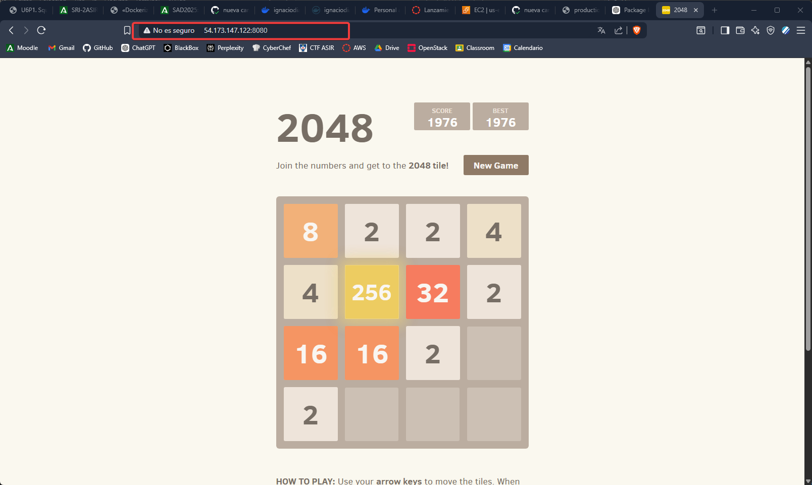

# Practica-5.4-Dockerizar Imagen
- En esta practica vamos a subir una imagen hecha por nosotros mismos a DockerHub para eso necesitamos primero nuestro dockerfile con el cual vamos a contruir nuestra imagen.

``` yml
#Capa base 
FROM ubuntu:24.04

#Actualizamos los paquetes
RUN apt-get update && apt-get upgrade -y \
    && apt-get install nginx -y \
    && apt-get clean

#Configuramos el directorio de trabajos
WORKDIR /var/www/html

#Clonamos el repositorio de la aplicación
RUN apt-get install git -y \
    && git clone https://github.com/josejuansanchez/2048 \
    && mv 2048/* . \
    && rm -rf 2048 \
    && apt-get remove git -y \
    && apt-get clean
#Definimos el entrypoint
ENTRYPOINT ["nginx", "-g", "daemon off;"]
```

- Una vez tenemos el archivo vamos a crearemos a partir de este nuestra imagen para usar, con el comando **docker build -t <nombre>/2048** de esta manera creamos la imagen, ademas antes e eso si queremos le podemos poner un tag a nuestra imagen tras crearla usando el comando **docker tag**.





## Subida a DockerHub
- Ahora subiremos nuetra imagen a docker hub, pero de forma automatica usando gitHub, para esto necesitaremos, primero tener una cuenta de Docker Hub, y se asume que ya tienes de GitHub, con la cuenta ya hecha generaremos 2 tokens en el Docker Gub, los cuales pondremos mediante secretos en nuestro Repositorio de Github, una vez tengamos los secretos con el token en nuestro repo haremos un push.





- Si todo va bien deberemos de poder ver como se ejecuta en nuestro github el mandarlo al Docker Hub.



# Descargar de Docker Hub

- Por ultimo vamos a descagar de lo que nosotros mismos hemos subido y vamos a correr en la maquina para ver que todo esta funcionano de forma correcta.





